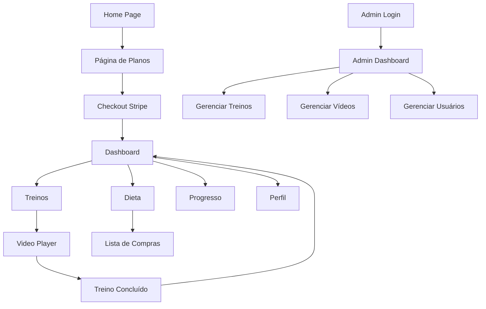

## 1. Product Overview
O Barriga 30 é um PWA (Progressive Web App) de fitness com programa de 30 dias para perda de gordura abdominal, combinando treinos em vídeo de 30 minutos, dieta hipocalórica e gamificação intensa estilo Duolingo.

O produto visa pessoas iniciantes a avançadas que buscam resultados claros, constância diária e experiência motivadora, principalmente mulheres que querem treinos rápidos e eficazes.

## 2. Core Features

### 2.1 User Roles
| Role | Registration Method | Core Permissions |
|------|---------------------|------------------|
| Usuário Gratuito | Email registration | Acesso limitado, pode ver planos |
| Assinante Básico | Email + pagamento Stripe | Acesso a treinos, dieta e lista de compras |
| Assinante Plus | Email + pagamento Stripe | Acesso completo a todos os recursos |
| Assinante VIP | Email + pagamento Stripe | Acesso premium com recursos exclusivos |
| Admin | Convite interno | Gerenciar vídeos, treinos e usuários |

### 2.2 Feature Module
O Barriga 30 consiste nas seguintes páginas principais:
1. **Home page**: apresentação do produto, planos e call-to-action.
2. **Página de planos**: comparação detalhada dos 3 planos de assinatura.
3. **Checkout**: integração com Stripe para pagamento.
4. **Login/Cadastro**: autenticação via Supabase.
5. **Dashboard**: visão geral do progresso e acesso rápido aos recursos.
6. **Treinos**: lista de treinos por nível e player de vídeo com timer.
7. **Dieta**: plano alimentar personalizado baseado em TMB.
8. **Lista de compras**: checklist gerado automaticamente da dieta.
9. **Progresso**: histórico de treinos, registro de peso e fotos before/after.
10. **Perfil**: informações pessoais e configurações.
11. **Admin**: upload de vídeos e gerenciamento de conteúdo.

### 2.3 Page Details
| Page Name | Module Name | Feature description |
|-----------|-------------|---------------------|
| Home page | Hero section | Apresentação do programa com call-to-action principal para assinatura. Mostra benefícios e depoimentos. |
| Home page | Planos preview | Cards visuais dos 3 planos com preços e principais diferenciais. |
| Página de planos | Comparação detalhada | Tabela comparativa com todos os recursos de cada plano. Botão de assinatura destacado. |
| Checkout | Stripe integration | Formulário de pagamento integrado com Stripe, suportando cartão de crédito. |
| Login/Cadastro | Auth form | Formulários de login e cadastro com email, senha e recuperação de senha. |
| Dashboard | Progress overview | Cards com streak diário, pontos acumulados, próximo treino e progresso geral. |
| Dashboard | Quick actions | Acesso rápido a treinos, dieta e lista de compras. |
| Treinos | Workout list | Grid de treinos organizados por nível (iniciante/intermediário/avançado). |
| Treinos | Video player | Player com contador regressivo por exercício, timer total, nome do exercício visível. |
| Treinos | Exercise transition | Tela de preparação de 10 segundos entre exercícios. |
| Dieta | Meal plan | Visualização semanal da dieta com refeições detalhadas e valores nutricionais. |
| Lista de compras | Shopping checklist | Lista organizada por categoria com checkbox para marcar itens comprados. |
| Lista de compras | Export | Botão para exportar lista em formato CSV. |
| Progresso | Workout history | Calendário visual mostrando treinos completados com marcação visual. |
| Progresso | Weight tracking | Gráfico de evolução de peso com registro manual. |
| Progresso | Photo upload | Upload de fotos before/after com visualização em timeline privada. |
| Perfil | User info | Formulário editável com nome, sexo, idade, altura, peso e nível. |
| Admin | Video upload | Interface para upload de vídeos com thumbnail automática. |
| Admin | Workout management | CRUD de treinos com associação de vídeos e exercícios. |
| Admin | User management | Lista de usuários com status de assinatura e dados básicos. |

## 3. Core Process
### Fluxo do Usuário Regular:
1. Usuário acessa a home page e visualiza os planos
2. Escolhe um plano e é direcionado para o checkout
3. Realiza pagamento via Stripe
4. Recebe confirmação e acesso ao dashboard
5. Acessa treinos diários através do player com timer
6. Marca treino como concluído e ganha pontos
7. Acessa dieta e lista de compras conforme plano
8. Registra progresso com peso e fotos

### Fluxo do Admin:
1. Admin faz login com credenciais especiais
2. Acessa painel de administração
3. Faz upload de novos vídeos de treino
4. Cria/gerencia treinos e associa vídeos
5. Visualiza estatísticas de usuários e assinaturas

## 4. User Interface Design
### 4.1 Design Style
- **Cores primárias**: Coral (#FF4D4D) para CTAs e progresso
- **Cores secundárias**: Verde (#2FBF71) para sucesso e saúde
- **Background**: Bege claro (#F7F3ED)
- **Cards/superfícies**: Branco (#FFFFFF)
- **Texto primário**: #1F2937
- **Texto secundário**: #6B7280
- **Estilo de botões**: Arredondados com sombra suave
- **Fonte**: System font stack para melhor performance
- **Tamanhos de fonte**: 16px base, escalonamento para headers
- **Layout**: Card-based com espaçamento generoso
- **Ícones**: Estilo outline minimalista

### 4.2 Page Design Overview
| Page Name | Module Name | UI Elements |
|-----------|-------------|-------------|
| Home page | Hero section | Background bege com texto em #1F2937, CTA coral destacado, imagem de mulher treinando. |
| Dashboard | Progress cards | Cards brancos com bordas arredondadas, ícones verdes para sucesso, coral para streak. |
| Treinos | Workout grid | Grid 2x2 em mobile, cards com thumbnail do vídeo e duração. Player em fullscreen. |
| Video player | Timer display | Contador grande no centro, nome do exercício embaixo, controles discretos. |
| Dieta | Meal cards | Cards brancos organizados por refeição, cores verdes para alimentos saudáveis. |
| Progresso | Photo timeline | Layout de galeria com upload discreto, fotos em cards brancos com data. |

### 4.3 Responsiveness
- **Desktop-first approach** com mobile-adaptive design
- **Breakpoints**: 640px, 768px, 1024px, 1280px
- **Touch optimization** para interações em mobile
- **PWA installable** com manifest.json
- **Viewport meta tag** para escala adequada

### 4.4 3D Scene Guidance
Não aplicável - este produto não envolve conteúdo 3D.