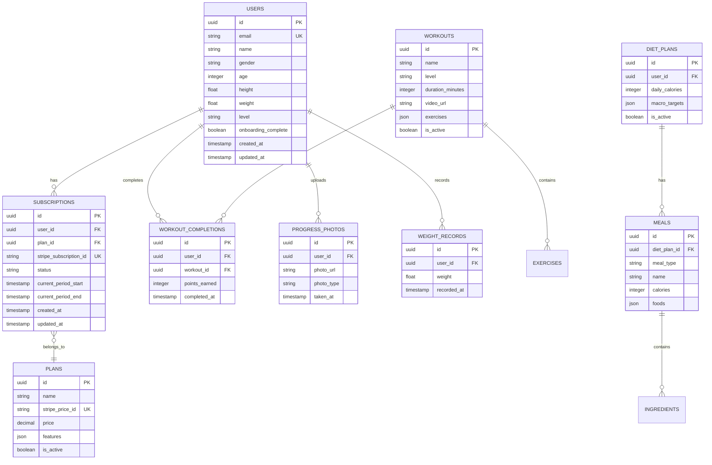

## 1. Architecture design


## 2. Technology Description

* **Frontend**: Next.js\@14 + React\@18 + Tailwind CSS\@3

* **Initialization Tool**: create-next-app

* **Backend**: Supabase (Auth, PostgreSQL, Storage)

* **Payments**: Stripe (Checkout, Subscriptions, Webhooks)

* **State Management**: React Context + SWR

* **Video Player**: Video.js ou React Player

* **PWA**: next-pwa

* **Deploy**: Vercel

## 3. Route definitions

| Route                         | Purpose                                           |
| ----------------------------- | ------------------------------------------------- |
| /                             | Home page com apresentação e call-to-action       |
| /planos                       | Página de comparação de planos de assinatura      |
| /checkout                     | Checkout Stripe para pagamento                    |
| /login                        | Página de login com formulário                    |
| /cadastro                     | Página de registro de novos usuários              |
| /dashboard                    | Dashboard principal com progresso e ações rápidas |
| /treinos                      | Lista de treinos por nível                        |
| /treinos/\[id]                | Player de vídeo para treino específico            |
| /dieta                        | Plano alimentar personalizado                     |
| /lista-compras                | Checklist de compras gerado da dieta              |
| /progresso                    | Histórico de progresso e fotos                    |
| /perfil                       | Configurações de perfil do usuário                |
| /admin                        | Painel administrativo                             |
| /admin/treinos                | Gerenciamento de treinos                          |
| /admin/videos                 | Upload e gerenciamento de vídeos                  |
| /admin/usuarios               | Visualização de usuários e assinaturas            |
| /api/auth/callback            | Callback de autenticação Supabase                 |
| /api/stripe/webhook           | Webhook para atualização de assinaturas           |
| /api/integrations/quiz-result | Endpoint para integração futura do quiz           |

## 4. API definitions

### 4.1 Authentication APIs

```
POST /api/auth/login
```

Request:

| Param Name | Param Type | isRequired | Description      |
| ---------- | ---------- | ---------- | ---------------- |
| email      | string     | true       | Email do usuário |
| password   | string     | true       | Senha do usuário |

Response:

| Param Name | Param Type | Description                  |
| ---------- | ---------- | ---------------------------- |
| user       | object     | Dados do usuário autenticado |
| session    | object     | Sessão do Supabase           |

### 4.2 Stripe Integration APIs

```
POST /api/stripe/create-checkout-session
```

Request:

| Param Name | Param Type | isRequired | Description                    |
| ---------- | ---------- | ---------- | ------------------------------ |
| priceId    | string     | true       | ID do preço Stripe             |
| userId     | string     | true       | ID do usuário                  |
| planType   | string     | true       | Tipo do plano (basic/plus/vip) |

Response:

| Param Name | Param Type | Description         |
| ---------- | ---------- | ------------------- |
| sessionId  | string     | ID da sessão Stripe |
| url        | string     | URL do checkout     |

```
POST /api/stripe/webhook
```

Eventos processados:

* `checkout.session.completed`: Ativa assinatura

* `customer.subscription.updated`: Atualiza status

* `customer.subscription.deleted`: Cancela assinatura

### 4.3 Quiz Integration Endpoint (Futuro)

```
POST /api/integrations/quiz-result
```

Request:

| Param Name         | Param Type | isRequired | Description                                        |
| ------------------ | ---------- | ---------- | -------------------------------------------------- |
| user\_id           | string     | true       | ID do usuário                                      |
| recommended\_level | string     | true       | Nível recomendado (beginner/intermediate/advanced) |
| tmb                | number     | true       | Taxa metabólica basal                              |
| tdee               | number     | true       | Gasto energético total                             |
| preferences        | object     | false      | Preferências alimentares                           |
| equipment          | array      | false      | Equipamentos disponíveis                           |

Response:

| Param Name       | Param Type | Description        |
| ---------------- | ---------- | ------------------ |
| success          | boolean    | Status da operação |
| updated\_profile | object     | Perfil atualizado  |

## 5. Server architecture diagram


## 6. Data model

### 6.1 Data model definition



### 6.2 Data Definition Language

**Users Table (users)**

```sql
-- create table
CREATE TABLE users (
  id UUID PRIMARY KEY DEFAULT gen_random_uuid(),
  email VARCHAR(255) UNIQUE NOT NULL,
  name VARCHAR(100) NOT NULL,
  gender VARCHAR(20) CHECK (gender IN ('male', 'female', 'other')),
  age INTEGER CHECK (age > 0 AND age < 120),
  height DECIMAL(5,2) CHECK (height > 0),
  weight DECIMAL(5,2) CHECK (weight > 0),
  level VARCHAR(20) DEFAULT 'beginner' CHECK (level IN ('beginner', 'intermediate', 'advanced')),
  onboarding_complete BOOLEAN DEFAULT false,
  created_at TIMESTAMP WITH TIME ZONE DEFAULT NOW(),
  updated_at TIMESTAMP WITH TIME ZONE DEFAULT NOW()
);

-- create indexes
CREATE INDEX idx_users_email ON users(email);
CREATE INDEX idx_users_level ON users(level);

-- enable RLS
ALTER TABLE users ENABLE ROW LEVEL SECURITY;

-- create policies
CREATE POLICY "Users can view own profile" ON users FOR SELECT USING (auth.uid() = id);
CREATE POLICY "Users can update own profile" ON users FOR UPDATE USING (auth.uid() = id);
```

**Subscriptions Table (subscriptions)**

```sql
-- create table
CREATE TABLE subscriptions (
  id UUID PRIMARY KEY DEFAULT gen_random_uuid(),
  user_id UUID REFERENCES users(id) ON DELETE CASCADE,
  plan_id UUID REFERENCES plans(id),
  stripe_subscription_id VARCHAR(255) UNIQUE,
  status VARCHAR(50) DEFAULT 'active' CHECK (status IN ('active', 'canceled', 'past_due', 'incomplete')),
  current_period_start TIMESTAMP WITH TIME ZONE,
  current_period_end TIMESTAMP WITH TIME ZONE,
  created_at TIMESTAMP WITH TIME ZONE DEFAULT NOW(),
  updated_at TIMESTAMP WITH TIME ZONE DEFAULT NOW()
);

-- create indexes
CREATE INDEX idx_subscriptions_user_id ON subscriptions(user_id);
CREATE INDEX idx_subscriptions_status ON subscriptions(status);
CREATE INDEX idx_subscriptions_period_end ON subscriptions(current_period_end);

-- enable RLS
ALTER TABLE subscriptions ENABLE ROW LEVEL SECURITY;

-- create policies
CREATE POLICY "Users can view own subscriptions" ON subscriptions FOR SELECT USING (auth.uid() = user_id);
```

**Workouts Table (workouts)**

```sql
-- create table
CREATE TABLE workouts (
  id UUID PRIMARY KEY DEFAULT gen_random_uuid(),
  name VARCHAR(255) NOT NULL,
  level VARCHAR(20) CHECK (level IN ('beginner', 'intermediate', 'advanced')),
  duration_minutes INTEGER CHECK (duration_minutes > 0),
  video_url TEXT,
  exercises JSONB,
  is_active BOOLEAN DEFAULT true,
  created_at TIMESTAMP WITH TIME ZONE DEFAULT NOW()
);

-- create indexes
CREATE INDEX idx_workouts_level ON workouts(level);
CREATE INDEX idx_workouts_active ON workouts(is_active);

-- enable RLS
ALTER TABLE workouts ENABLE ROW LEVEL SECURITY;

-- create policies
CREATE POLICY "Anyone can view active workouts" ON workouts FOR SELECT USING (is_active = true);
CREATE POLICY "Admin can manage all workouts" ON workouts FOR ALL USING (auth.jwt() ->> 'role' = 'admin');
```

**Workout Completions Table (workout\_completions)**

```sql
-- create table
CREATE TABLE workout_completions (
  id UUID PRIMARY KEY DEFAULT gen_random_uuid(),
  user_id UUID REFERENCES users(id) ON DELETE CASCADE,
  workout_id UUID REFERENCES workouts(id) ON DELETE CASCADE,
  points_earned INTEGER DEFAULT 10,
  completed_at TIMESTAMP WITH TIME ZONE DEFAULT NOW()
);

-- create indexes
CREATE INDEX idx_workout_completions_user_id ON workout_completions(user_id);
CREATE INDEX idx_workout_completions_workout_id ON workout_completions(workout_id);
CREATE INDEX idx_workout_completions_completed_at ON workout_completions(completed_at DESC);

-- enable RLS
ALTER TABLE workout_completions ENABLE ROW LEVEL SECURITY;

-- create policies
CREATE POLICY "Users can view own completions" ON workout_completions FOR SELECT USING (auth.uid() = user_id);
CREATE POLICY "Users can insert own completions" ON workout_completions FOR INSERT WITH CHECK (auth.uid() = user_id);
```

**Progress Photos Table (progress\_photos)**

```sql
-- create table
CREATE TABLE progress_photos (
  id UUID PRIMARY KEY DEFAULT gen_random_uuid(),
  user_id UUID REFERENCES users(id) ON DELETE CASCADE,
  photo_url TEXT NOT NULL,
  photo_type VARCHAR(50) CHECK (photo_type IN ('before', 'after', 'progress')),
  taken_at TIMESTAMP WITH TIME ZONE DEFAULT NOW()
);

-- create indexes
CREATE INDEX idx_progress_photos_user_id ON progress_photos(user_id);
CREATE INDEX idx_progress_photos_type ON progress_photos(photo_type);

-- enable RLS
ALTER TABLE progress_photos ENABLE ROW LEVEL SECURITY;

-- create policies
CREATE POLICY "Users can view own photos" ON progress_photos FOR SELECT USING (auth.uid() = user_id);
CREATE POLICY "Users can upload own photos" ON progress_photos FOR INSERT WITH CHECK (auth.uid() = user_id);
CREATE POLICY "Users can delete own photos" ON progress_photos FOR DELETE USING (auth.uid() = user_id);
```

**Weight Records Table (weight\_records)**

```sql
-- create table
CREATE TABLE weight_records (
  id UUID PRIMARY KEY DEFAULT gen_random_uuid(),
  user_id UUID REFERENCES users(id) ON DELETE CASCADE,
  weight DECIMAL(5,2) NOT NULL CHECK (weight > 0),
  recorded_at TIMESTAMP WITH TIME ZONE DEFAULT NOW()
);

-- create indexes
CREATE INDEX idx_weight_records_user_id ON weight_records(user_id);
CREATE INDEX idx_weight_records_recorded_at ON weight_records(recorded_at DESC);

-- enable RLS
ALTER TABLE weight_records ENABLE ROW LEVEL SECURITY;

-- create policies
CREATE POLICY "Users can view own weight records" ON weight_records FOR SELECT USING (auth.uid() = user_id);
CREATE POLICY "Users can insert own weight records" ON weight_records FOR INSERT WITH CHECK (auth.uid() = user_id);
```

**Grant permissions**

```sql
-- Grant basic access to anon and authenticated roles
GRANT SELECT ON workouts TO anon;
GRANT SELECT ON plans TO anon;
GRANT ALL PRIVILEGES ON users TO authenticated;
GRANT ALL PRIVILEGES ON subscriptions TO authenticated;
GRANT ALL PRIVILEGES ON workout_completions TO authenticated;
GRANT ALL PRIVILEGES ON progress_photos TO authenticated;
GRANT ALL PRIVILEGES ON weight_records TO authenticated;
```

